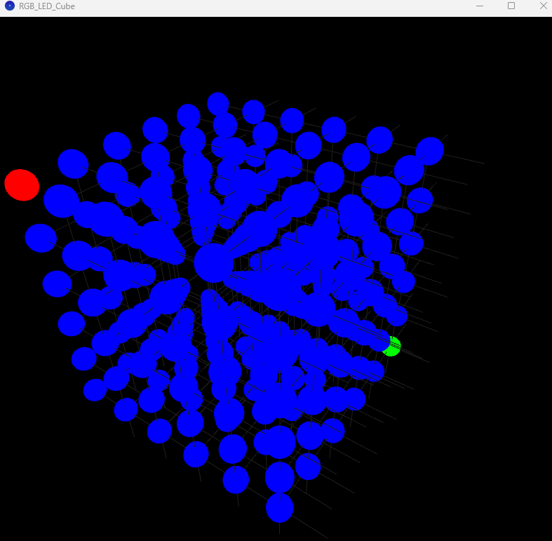

# jisc_ssd
## 概要
[gpsnmeajp氏の JISC-SSD PJ](https://github.com/gpsnmeajp/jisc_ssd)のforkです。
LEDキューブを制御するプログラムを追加して、NAND型フラッシュメモリの書き込み状態を可視化します。
当リポジトリをお試し頂くには[JISC-SSD(Jisaku In-Storage Computation SSD学習ボード)](https://crane-elec.co.jp/products/vol-28/)が必要です。

ご参考: [https://note.com/gpsnmeajp/n/n7a85a5118065](https://note.com/gpsnmeajp/n/n7a85a5118065)

Arduino IDE + [earlephilhower/arduino-pico](https://github.com/earlephilhower/arduino-pico) を導入した環境で、  
JISC-SSDに転送すると動作します。

Windows 11環境で動作確認。

誤りや、バグが色々とある可能性があります。

jisc_ssd_*.ino　が各スケッチに散らばっていますが、それぞれ微妙に異なるためご注意ください。  
(速度チューニングが入っていたり、誤り訂正処理が入っていたり)

## ssd.ino
デバッグツールです

SDKをPico SDKに設定してください。

書き込むと、USBからの接続待ちとなり、LEDが高速に点滅します。  
TeraTermなど端末エミュレータでCOMポートに接続してください。(改行コードはLFにしてください)

操作内容は画面を参照してください。

## msc_ecc_ledCube.ino
USB-SSDとして認識させるサンプルです。
LEDキューブを制御し、NAND型フラッシュメモリのデータを可視化します。

Processing で RGB_LED_Cube を実行した状態でシリアル通信で接続すると、LEDキューブの実機の代わりになります。

下記のmsc.inoに拡張ハミング符号(8,4)を実装して、ビットエラーに対処した代わりに、  
容量が半分(62MB)になったバージョンです。

実用的ではありません。  
**決して大切なデータを保存しないで下さい**

## msc.ino
USB-SSDとして認識させるサンプルです

誤り訂正をしていないため、必ずビットエラーが発生します。  
実用的ではありません。  
**決して大切なデータを保存しないで下さい**

SDKをTinyUSBに設定してください。

125MBのUSBマスストレージデバイスとして認識します。

1024ブロック中、1000ブロックを使用します。  
24ブロックはBad Block用の予備です。

誤り訂正なし。1ページあたり2176byte中2048byte使用します。  
(128byteは将来の誤り訂正に備える)

Bad Blockの対応は固定テーブル方式です。
先にssd.inoなどを使って、Bad Blockをチェックしておいてください。  
その上で、下記関数のBad Block置き換えを適切に書き換えてください。  
int bad_block_replace(int page)

ウェアレベリングなし

Trimなし

